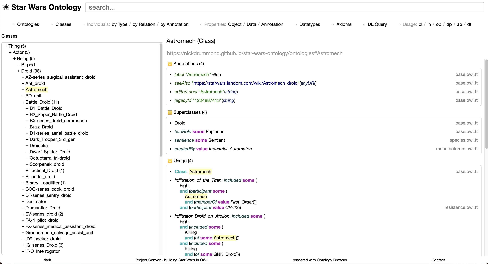
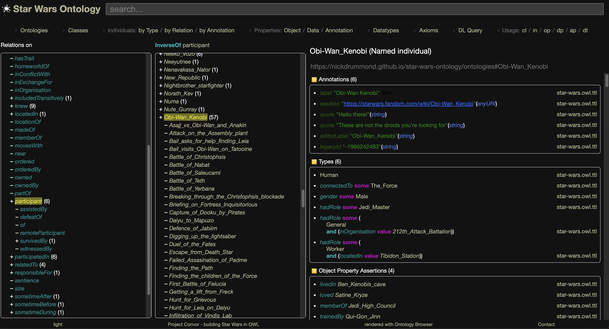
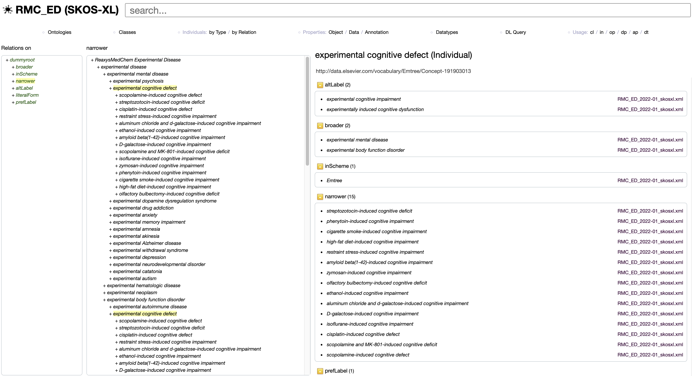

# Ontology Browser

The browser loads a single OWL ontology (and its imports) on startup and 
renders it for easy navigation.

[Example using the Star Wars Ontology](https://www.star-wars-ontology.co.uk/)



## Features
* Navigation of all entities (classes, properties, individuals and datatypes)
* Hierarchies, subclass/property/relations/annotations
* Entity usage
* Manchester OWL Syntax rendering
* Ontology metrics
* Searching
* DL Query (with set subtraction)
* Axioms view (and search)
* Paging
* Dark mode
* Graphs (graph profile)
* Git history (git profile)



## Run

### Profiles

The following profiles are supported
* **dev** for turning off caching and other local options
* **reasoners** enable scanning for various DL reasoners (eg Pellet, JFact) on startup for use in DL Query, otherwise simple structural reasoner is used
* **graph** show graphs for individuals (experimental)
* **git** show a history for the ontology if it is stored in a git repo (experimental)

Use the following java option on run to enable the profile
```
-Dspring.profiles.active=dev,reasoners
```

## Deploy

Ontology Browser is a Spring Boot application and can be deployed to any servlet container.
For advice on this, please see the Spring docs
https://docs.spring.io/spring-boot/how-to/deployment/index.html

### Docker

Docker Hub repo https://hub.docker.com/r/nickdrummond/ontology-browser

Create your own docker image with your ontology - your Dockerfile would look something like this:
```dockerfile
FROM nickdrummond/ontology-browser:latest
COPY ./ontologies /ontologies
ENV SPRING_PROFILES_ACTIVE="reasoners,graph,lucene"
ENV ONTOLOGY_ROOT_LOCATION=""/examples/pizza.owl"
ENV REASONING_ROOT_IRI="http://www.co-ode.org/ontologies/pizza"
ENV LABEL_IRI="http://www.w3.org/2000/01/rdf-schema#label"
ENV PROJECT_NAME="Pizza"
ENV PROJECT_TAGLINE="The Pizza Ontology"
ENV PROJECT_URL="https://github.com/owlcs/pizza-ontology"
```

Or, build the browser docker image yourself
```shell
mvn spring-boot:build-image
```

And then run it using a local ontology file
```shell
docker run --env-file ./examples/pizza.env --mount type=bind,source=./examples,target=/examples -p 8080:8080 nickdrummond/ontology-browser
```

### Configuration

To load your own, set the root ontology location and reasoner root ontology IRI environment variables:

    ONTOLOGY_ROOT_LOCATION=<your ontology URL>
    REASONING_ROOT_IRI=<IRI of the ontology to be reasoned with>
    PROJECT_NAME=<Ontology name>
    PROJECT_URL=<Project documentation url>
    PROJECT_TAGLINE=<Project tagline text>
    PROJECT_CONTACT=<Email address of contact>
    INDEX_TYPE=<CLASSES_USAGE_CLOUD|INDIVIDUALS_USAGE_CLOUD|OBJECT_PROPERTIES_USAGE_CLOUD>
    LABEL_IRI=<IRI of the annotation property to use for rendering>

## SKOS/SKOS-XL support

The OWL API treats SKOS Concepts as individuals and their properties as annotations.

### Hierarchy
You can see the broader/narrower tree in the `individuals by Annotation` view


### Labels/rendering
For SKOS-XL terminologies, set LABEL_IRI=http://www.w3.org/2008/05/skos-xl#prefLabel
Concept "C" will be rendered as "C Label" if the conventional SKOS-XL reified labelling is used in the loaded terminology:

    C Type skos:Concept
    l Type skosxl:Label
    C -> skosxl:prefLabel -> l
    l -> skosxl:literalForm -> "C Label"

### Git support
Instead of just referencing a local OWL file, the browser can be set to track ontologies from a git repo.
This enables a browsable history of the ontology repo in the browser.
And, if the repo is tracking, with a remote specified, it will show if the ontologies have been updated remotely since they were loaded.

If you have the "git" profile enabled, you must either supply a local repo or a remote repo (which will be cloned).

    GIT_LOCAL=<the root of the git directory> (default = data/) # should be aligned with ONTOLOGY_ROOT_LOCATION
    GIT_REMOTE=<remote git repository>
    GIT_BRANCH=<branch> (default = master)

## Implementation

This is implemented using Java 20, Spring Boot, [OWLAPI](https://github.com/owlcs/owlapi) and Thymeleaf.

Some dependencies are local (in /repo) as they do not exist on any mvn repo.


## Status

This is a personal project and all development is on a purely "as time allows" basis.

There is no release schedule or plan as I currently have no known users.
If you wish to use this project in a production environment, please consider contacting me and considering
funding development and support. Alternatively, you may fork the project and maintain it yourself.

This is a "fork" of the ontology browser from the [CO-ODE project](https://code.google.com/p/ontology-browser/) now hosted at https://github.com/co-ode-owl-plugins/ontology-browser.

Unlike v1, there is no storing of sessions/multi config.
