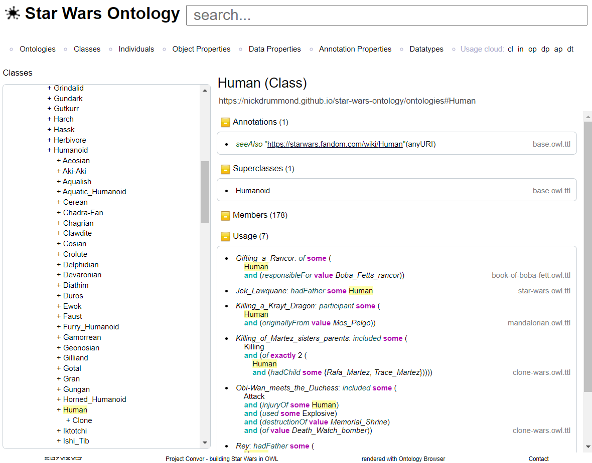

# Ontology Browser

The browser loads a single ontology (and its imports) on startup and 
renders it for easy navigation.

## Features
* Navigation of all entities (classes, properties, individuals and datatypes)
* Hierarchies
* Entity usage
* Manchester OWL Syntax rendering
* Ontology metrics
* Searching
* DL Query (with set subtraction)

## Run

Set the root ontology location and reasoner root ontology IRI environment variables:

    ONTOLOGY_ROOT_LOCATION=<your ontology URL>
    REASONING_ROOT_IRI=<IRI of the ontology to be reasoned with>
    PROJECT_NAME=<Ontology name>
    PROJECT_URL=<Project documentation url>
    PROJECT_TAGLINE=<Project tagline text>
    PROJECT_CONTACT=<Email address of contact>

Using maven to build:

`mvn clean package cargo:run`

## Notes

This is a "fork" of the ontology browser from the [CO-ODE project](https://code.google.com/p/ontology-browser/) now hosted at https://github.com/co-ode-owl-plugins/ontology-browser.

Unlike v1, there is no storing of sessions/multi config.

## Implementation

This is implemented using Java 11, Spring MVC, [OWLAPI](https://github.com/owlcs/owlapi), Thymeleaf.

Some dependencies are local (in /repo) as they do not exist on any mvn repo.
