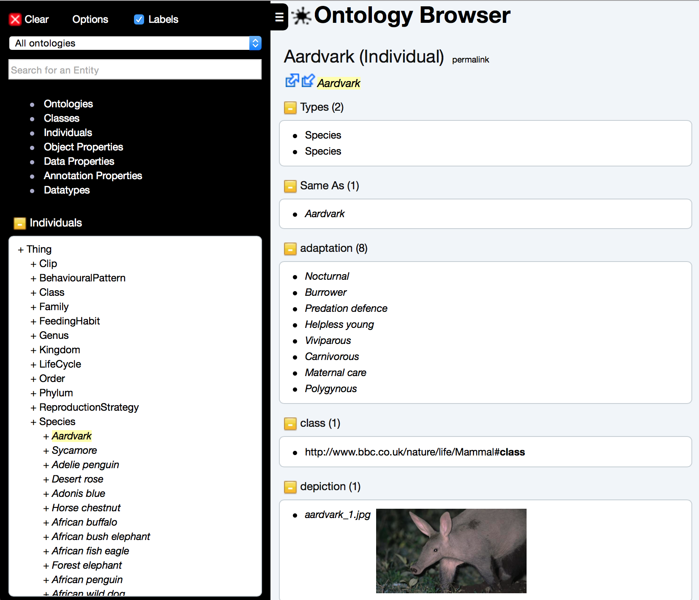

# Ontology Browser

A "fork" of the ontology browser from the [CO-ODE project](https://code.google.com/p/ontology-browser/) now hosted at https://github.com/co-ode-owl-plugins/ontology-browser.

Unfortunately, the mongo db implementation used for the
demo on heroku is no longer available (someone want to migrate to an alternative?)

## Aims
* Make it easily buildable - maven
* Make it easily runnable - jetty (local) heroku (remote)
* Have it running again for demo purposes
* Make it more scalable - sort out stupid config problems
* Extract all rendering into views - jsp? or maybe just go full blown Spring MVC
* Tests!!

## Run locally

Ontology Browser uses MongoDB to store permalink information.
MongoDB should be running on localhost on the default port before starting.

Using maven to build.
Some dependencies are local (in /repo) as they do not exist on any mvn repo.

`mvn clean package cargo:run`

## Deployment to Heroku

Unfortunately, the mongo implementation used on heroku is no longer available and
I have no dev time to migrate to another store.

## TODO

* link to dl-query tab
  * dl query not identifying properties - 
    
    java.util.regex.PatternSyntaxException: Unclosed group near index 12
    (killingof.*
    at java.util.regex.Pattern.error(Pattern.java:1969)
    
* links to clouds
* fix permalink on dl-query tab
* Scrollbars in left navigation
  (removed but how about mobile?)
* No inference when JFact selected (Rebel Scum)
  http://127.0.0.1:8080/?label=c0154cd07d7b26a39ea1e11b7ce220f7_588a8713faa332a36257fe98fb6efe04&redirect=/classes/-738385071/
